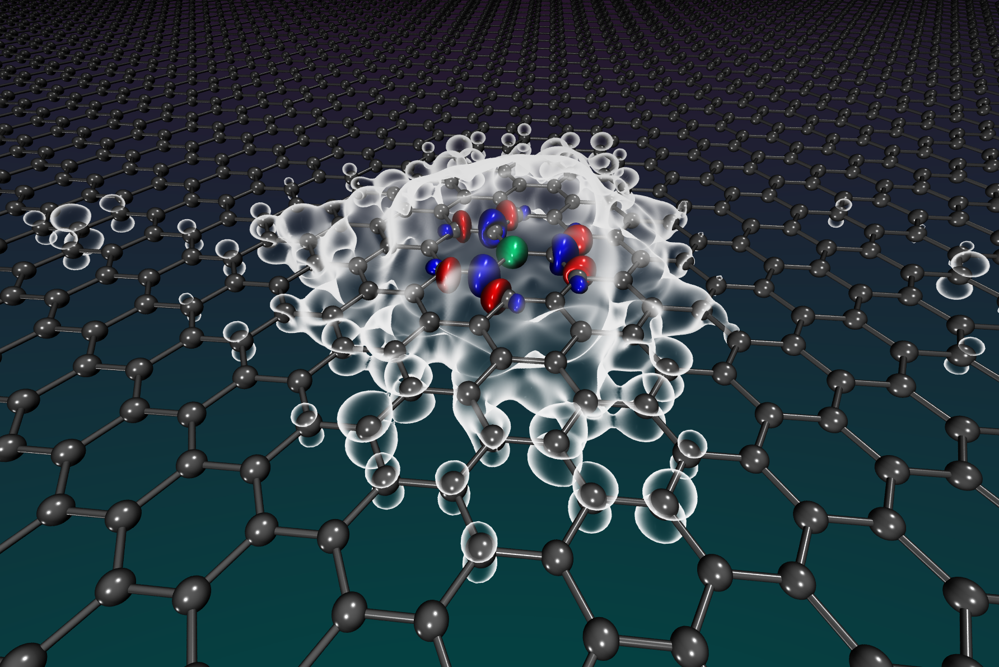

.. include:: /include/links.rst
.. _intro:

    Embedding of a carbon atom in graphene.

============
Introduction
============

Vayesta_ is a Python package for performing correlated wave function-based quantum embedding
in *ab initio* molecules and solids, as well as lattice models.

It builds on the functionality of the PySCF_ package to set up the system and obtain mean-field properties.
With Vayesta one can define fragments within these systems in a highly flexible way
and add bath orbitals to represent the coupling of each fragment to its extended environment,
with various approaches actively developed.
The resulting quantum embedding problems can be solved with a variety of wave function based solvers,
making use of the efficient implementations within PySCF.
As a final step, expectation values, such as the energy or reduced density-matrices,
can be reconstructed from the collection of individually-solved embedding problems.
Vayesta also offers support for self-consistency in the procedure or closer coupling in the solutions of the embedding problems.

The package and methods are actively developed.

Features
--------

- Fragments can be flexibly defined in terms of sets of:
    - `Intrinsic atomic orbitals <REF_IAO_>`_ (IAO) [1]_
    - Intrinsic atomic orbitals + orthogonalized `projected atomic orbitals <REF_PAO_>`_ (IAO+PAO)
    - Symmetrically (Löwdin) orthogonalized atomic orbitals (SAO)
    - Site basis (for lattice models)

- Bath orbitals:
    - `Density-matrix embedding theory (DMET) <REF_DMET_>`_ bath orbitals [2]_
    - `MP2 bath natural orbitals <REF_PRX_>`_ [3]_
    - Spatially closest bath orbitals

- Quantum embedding problems can be solved with the following PySCF solvers:
    - Second-order Møller--Plesset perturbation theory (MP2)
    - Configuration interaction with single and double excitations (CISD)
    - Coupled-cluster with single and double excitations (CCSD)
    - Full configuration-interaction (FCI)
    - Dump orbitals and integrals of resulting embedded cluster to HDF5 file for external processing

Additional functionality is available for self-consistency and the definition of different resulting expectation values.

.. [1] Gerald Knizia, J. Chem. Theory Comput. 9, 11, 4834 (2013).
.. [2] Gerald Knizia and Garnet Kin-Lic Chan, Phys. Rev. Lett. 109, 186404 (2012).
.. [3] Max Nusspickel and George H. Booth, Phys. Rev. X 12, 011046 (2022).
