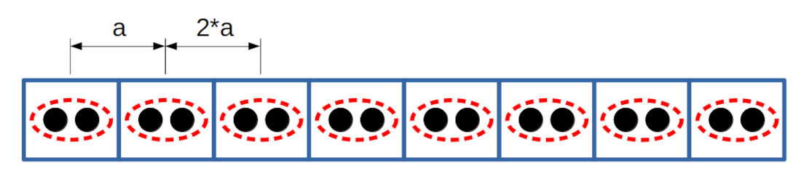

.. include:: /include/links.rst
.. _dmet:

Density matrix embbeding theory (DMET)
========================================

In the following tutorial, the Density-matrix embbeding theory (DMET) as implemented in Vayesta_ is introduced. Two examples (Finite systems and custom Hamiltonians) are used to illustrate the capabilities of this methodology.

Finite Systems
^^^^^^^^^^^^^^^^^^

To perform calculations using the `ref:DMET` module implemented in Vayesta_, a simple Lithium hydride (LiH) molecule has been selected. To perform electronic structure calculations, the corresponding PySCF_ modules are imported along the relevant Vayesta_ modules as shown in the following snippet:

.. literalinclude:: dmetsimple.py
   :lines: 1-4

The **LiH** system is initialized, using a molecular basis-set **cc-pVDZ** along another PySCF_ important properties which are declared to perform this calculation as displayed below:

.. literalinclude:: dmetsimple.py
   :lines: 7-12

The ground-state mean-field calculations are carried out at the Hartree-Fock (**HF**) level of theory as show in the following snippet:

.. literalinclude:: dmetsimple.py
   :lines: 14-16

The `ref:dmet.DMET` function can be used by providing two important arguments, namely, a mean-field computed ground-state and a corresponding **solver**. Currently, Vayesta_ offers the posibility to use 6 different solvers (**MP2, CISD, FCI, FCI-SPIN0, FCI_SPIN1**) as presented in the following lines of code:

.. literalinclude:: dmetsimple.py
   :lines: 18-19

For perfoming the **DMET** calculation, a fragmentation model is required. In this example, the **IAO** scheme is chosen mapping the Lithium and Hydrogen atom as shown in the snippet below:

.. literalinclude:: dmetsimple.py
   :lines: 20-24

where the method **dmet.kernel()** performs the computation. Finally, the total energies of the mean-field computation and the dmet calculation can be compared as shown in the following lines of code:

.. literalinclude:: dmetsimple.py
   :lines: 26-27

Custom Hamiltonians
^^^^^^^^^^^^^^^^^^^^

Costumized Hamiltonians can be also studied using the **DMET** methodology as implemented in Vayesta_. Initially, the required Vayesta_ modules are imported (and NumPy_ as an auxiliary library) as displayed in the following snippet:

.. literalinclude:: dmet1dhubbard.py
   :lines: 1-4

The most important parameters to set up the 1D Hubbard's model (as done in the module `ref:Lattmod`) are declared in the following lines of code:

.. literalinclude:: dmet1dhubbard.py
   :lines: 7-11

It is important to notice that function `ref:lattmod.Hubbard1D` contains different periodic boundary conditions, which in this case is the anti-periodic boundary condition. Using these variables as arguments, the corresponding `ref:lattmod.Hubbard1D` and `ref:lattmod.LatticeMF` are utilized to perform a mean-field calculation as displayed in this snippet:

.. literalinclude:: dmet1dhubbard.py
   :lines: 13-16

As in the finite case, a fragmentation scheme is needed to perform a **DMET** calculation. In the case of costumized Hamiltonians, the relevant the function is `ref:site_fragmentation`. The fragmentation procedure will be carried out using adjacent sites, as shown in the followin lines of code:

.. literalinclude:: dmet1dhubbard.py
   :lines: 18-23

The computation is carried out using the **FCI** solver. Alternatively, Vayesta_ can exploit the inherent translation symmetry displayed by the 1D-Hubbard's model. To use this option, one needs to declare a single fragment and then perform the translation over the desired direction. This can be done using the following lines of code:

.. literalinclude:: dmet1dhubbard.py
   :lines: 25-28

To specify translation vectors as parts of the full system lattice vectors by passing a list with three integers, **[n, m, l]**; the translation vectors will be set equal to the lattice vectors, divided by **n, m, l** in **a0, a1, and a2** direction, respectively. This is depicted schematically in **Figure(1)**.

   **Figure(1)** Schematic depiction of the 1-D Hubbard model, half filling with double-site embedding fragmentation using the tsymmetric feature.

In this case, this is done with the following command:

.. literalinclude:: dmet1dhubbard.py
   :lines: 35-37

To confirm that this is correct, the number of cpmputed fragments can be counted and validate against the expected number in the following manner:

.. literalinclude:: dmet1dhubbard.py
   :lines: 38-40

Both methodologies can be compared, as shown in the following snippet:

.. literalinclude:: dmet1dhubbard.py
   :lines: 42-44
