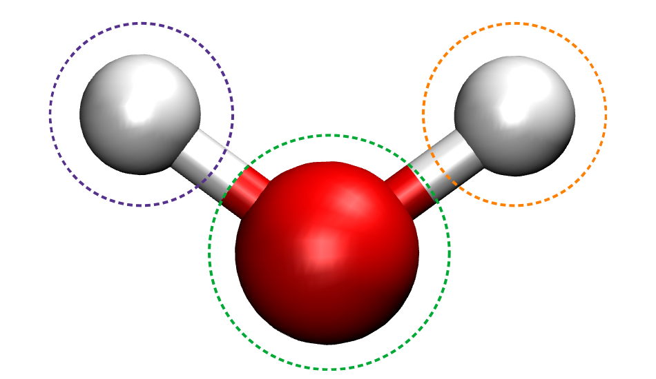

.. _molecules:

Using EWT for simulation of Molecules
=======================================

Vayesta_ employs electronic structure properties computed using PySCF_. The needed modules can be imported as it is shown in the following snipet:

.. literalinclude:: fragmentation.py
   :lines: 1-4

The corresponding modules to perform calculations with Vayesta_ are shown in the following codes of line:
	   
.. literalinclude:: fragmentation.py
   :lines: 6-7

The required electronic properties (ground state calculations) at the level of Restricted-Hartree-Fock (RHF) can be carried out as shown in the following snipet:
	   
.. literalinclude:: fragmentation.py
   :lines: 9-23

The PySCF_ results are subsequently used in the *EWF* Vayesta_ method as depicted in the following snippet:

.. literalinclude:: fragmentation.py
   :lines: 25-27

The succesfully use the *EWF* method, a fragementation scheme is needed. Vayesta_ uses the **IAO** fragmentation methodology as default if the kernel function has been invoked as is shown below:

.. literalinclude:: fragmentation.py
   :lines: 29-31

Alternatively, a second fragmentation procedure (i.e the IAO+PAOs method) can be carried out using the following lines:

.. literalinclude:: fragmentation.py
   :lines: 33-40

Similarly, specific orbitals like the Loewdin AOs can be used also as a valid framentation method. This is achieved as shown in the following snippet:
	   
.. literalinclude:: fragmentation.py
   :lines: 42-50

Another option is a manual fragmentation that can be carried out by computing IAOs and map those results to atoms. This can be schematically displayed in the following **Figure(1)**.

	      
   **Figure(1)**: Schematic depiction of the manual fragmentation procedure. 
	   
This can be computed using the following lines of code:

.. literalinclude:: fragmentation.py
   :lines: 53-66
	   
The results from the EWT module can be compared to CCSD (as implemented in
PySCF_) by enabling these lines of codes:

.. literalinclude:: fragmentation.py
   :lines: 68-77
	   
.. _PySCF: https://sunqm.github.io/pyscf/
.. _Vayesta: https://github.com/BoothGroup/Vayesta
